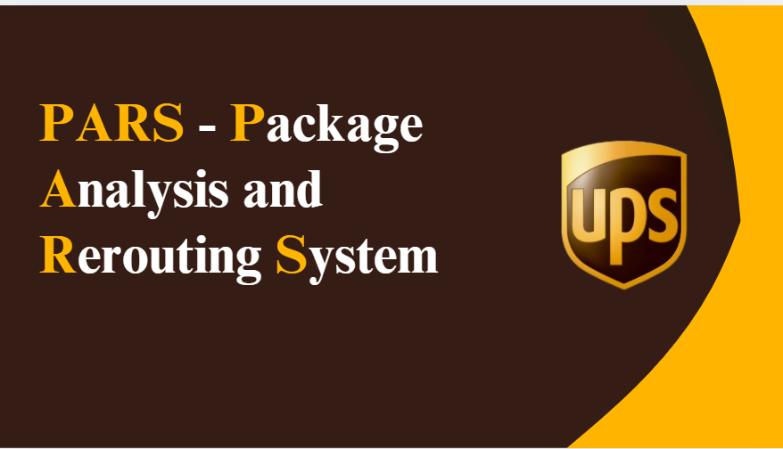

# UPS Label Processing & Analytics Platform

A full-stack application for uploading United Parcel Service (UPS) packaging labels (image or PDF), extracting metadata via OCR and AI, and providing analytics and CSV export features.

---

## Table of Contents

- [Features](#features)
- [Architecture](#architecture)
- [Backend](#backend)
  - [API Endpoints](#api-endpoints)
  - [Database Models](#database-models)
  - [Technologies Used](#technologies-used)
  - [Setup & Running](#setup--running)
- [Frontend](#frontend)
  - [Main Components](#main-components)
  - [Technologies Used](#technologies-used-1)
  - [Setup & Running](#setup--running-1)
- [Project Structure](#project-structure)
- [Testing](#testing)
- [License](#license)

---

## Features

- **Authentication**: Secure login and registration, with admin approval for new users.
- **File Upload**: Upload UPS label images or PDFs for OCR and AI-based metadata extraction.
- **OCR & Metadata Extraction**: Extract and display label metadata using Tesseract OCR and Google Gemini AI.
- **Dashboard**: View uploaded files and extracted metadata.
- **CSV Download**: Download metadata as CSV.
- **Analytics**: Embedded Power BI dashboard for data analytics.
- **User Management**: Admin can approve, reject, or delete users.

---

## Architecture

- **Backend**: FastAPI, SQLAlchemy, Tesseract OCR, Google Gemini AI
- **Frontend**: React, Material UI, Axios

---

## Backend

### API Endpoints

- **Authentication**
  - `POST /auth/register`: Register a new user (admin approval required for non-admins)
  - `POST /auth/token`: Obtain JWT access token
- **User Management**
  - `GET /users/me/`: Get current user info
  - `GET /users/`: List all users (admin only)
  - `POST /users/`: Create user (admin only)
  - `PUT /users/approve/{user_id}`: Approve user (admin only)
  - `PUT /users/reject/{user_id}`: Reject user (admin only)
  - `DELETE /users/{user_id}`: Delete user (admin only)
  - `DELETE /users/me/`: Delete own account
- **Image Processing**
  - `POST /upload-images-batch/`: Batch upload images
  - `POST /upload-image-single/`: Upload a single image
  - `GET /upload-records/`: Paginated list of uploaded records
  - `POST /extract`: Extract metadata from an uploaded file

### Database Models

- **UserCredential**: Stores user info, roles (admin/user), and approval status.
- **ImageProcessedData**: Stores uploaded file info, extraction status, and AI-extracted metadata (including addresses, tracking number, etc.).

### Technologies Used

- **FastAPI**: Web framework for building APIs.
- **SQLAlchemy**: ORM for database access.
- **Pydantic**: Data validation and settings management.
- **Tesseract OCR**: For extracting text from images.
- **Google Gemini AI**: For extracting structured metadata from OCR text.
- **Pillow**: Image validation and processing.
- **PyMySQL**: MySQL database driver.

#### Backend Dependencies

See `backend/requirements.txt` for the full list:
```
fastapi, uvicorn, pydantic, pytesseract, Pillow, python-dotenv, SQLAlchemy, pymysql, pydantic-settings, python-jose[cryptography], passlib[bcrypt], cursorai
```

### Setup & Running

1. **Clone the repo**
2. **Install dependencies**:
   ```bash
   pip install -r backend/requirements.txt
   ```
3. **Set up environment variables** (e.g., Tesseract path, Google API key) in a `.env` file.
4. **Run the backend server**:
   ```bash
   uvicorn backend.app.main:app --reload
   ```

---

## Frontend

### Main Components

- **LoginPage, RegisterPage**: User authentication.
- **DashboardPage**: View uploaded files and extracted metadata.
- **UploadPage**: Upload new label images or PDFs.
- **AnalyticsPage**: Embedded Power BI analytics.
- **UserManagementPage**: Admin user management.
- **ProfilePage**: User profile and account management.

### Technologies Used

- **React**: Frontend framework.
- **Material UI**: UI components.
- **Axios**: HTTP client for API requests.
- **JWT-Decode**: For handling authentication tokens.

#### Frontend Dependencies

See `frontend/Ups_Capstone_Project_frontend/package.json` for the full list:
```
@emotion/react, @emotion/styled, @mui/icons-material, @mui/material, axios, file-saver, jwt-decode, react, react-dom, react-json-to-table, react-router-dom, react-scripts
```

### Setup & Running

1. **Navigate to the frontend directory**:
   ```bash
   cd frontend/Ups_Capstone_Project_frontend
   ```
2. **Install dependencies**:
   ```bash
   npm install
   ```
3. **Run the frontend app**:
   ```bash
   npm start
   ```

---

## Project Structure

```
.
├── backend/
│   ├── app/
│   │   ├── routers/
│   │   ├── auth/
│   │   ├── models.py, main.py, ocr.py, ai_client.py, ...
│   ├── mistralai_nb/
│   ├── requirements.txt
│   └── tests/
├── frontend/
│   └── Ups_Capstone_Project_frontend/
│       ├── src/
│       │   ├── components/
│       │   ├── auth/
│       │   ├── utils/
│       │   └── App.jsx, index.js, ...
│       ├── public/
│       ├── package.json
│       └── README.md
├── uploads/
├── requirements.txt
├── main.py
└── ...
```

---
**Note:**  
- Ensure you have Tesseract OCR installed and its path configured in your environment.
- Set up your Google Gemini API key for AI extraction.
- The backend and frontend should run on compatible ports (default: backend 8000, frontend 3000).

---

## Project Demo

[](Demo/UPS Capstone Project PPT.pdf)
[Download Project Demo Presentation](Demo/UPS Capstone Project PPT.pdf)